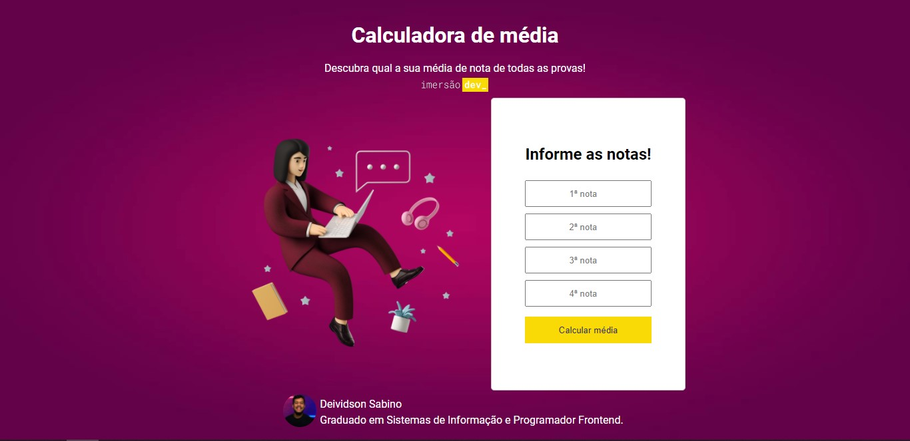

# Calculadora de média
Calculadora para calculo de notas, desenvolvido para o desafio da imersaodev da alura

# Objetivos:
* Dependendo da nota, mostrar se a aluna ou aluno foi aprovada(o) ou não
* Alterar o fundo da tela da maneira que achar mais legal
* Imprimir na própria página o resultado, ao invés do console
* Criar um conversor de temperaturas entre farenheit e celcius

